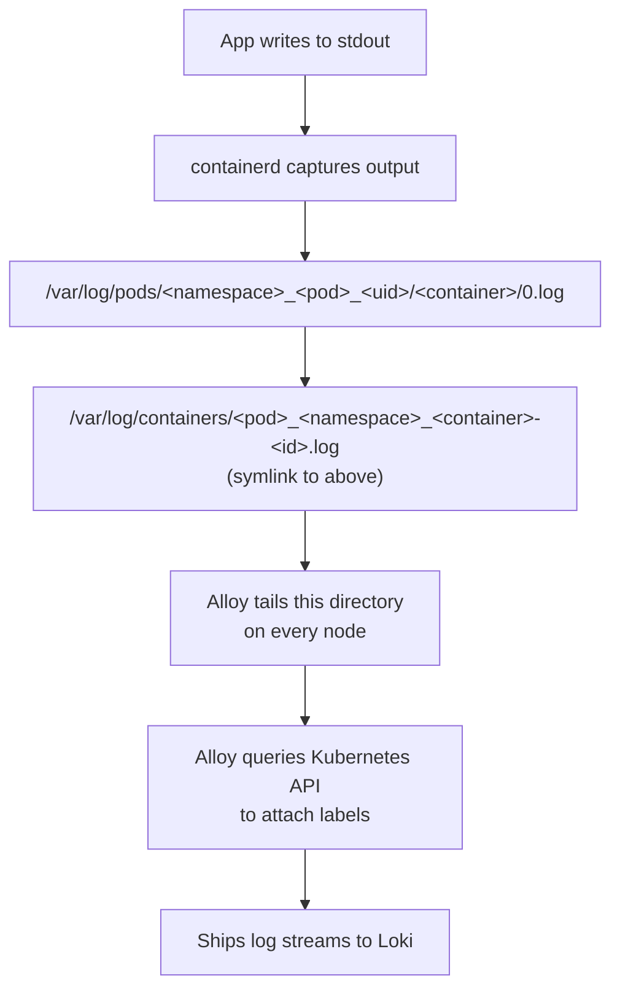

```mermaid
 flowchart TD
    A[App writes to stdout] --> B[containerd captures output]
    B --> C["/var/log/pods/&lt;namespace&gt;_&lt;pod&gt;_&lt;uid&gt;/&lt;container&gt;/0.log"]
    C --> D["/var/log/containers/&lt;pod&gt;_&lt;namespace&gt;_&lt;container&gt;-&lt;id&gt;.log\n(symlink to above)"]
    D --> E[Alloy tails this directory\non every node]
    E --> F[Alloy queries Kubernetes API\nto attach labels]
    F --> G[Ships log streams to Loki]
```
