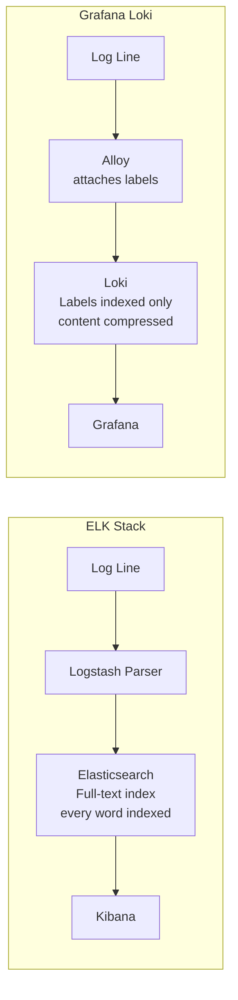

```mermaid
flowchart LR
    subgraph ELK["ELK Stack"]
        direction TB
        E1[Log Line] --> E2[Logstash Parser]
        E2 --> E3[Elasticsearch\nFull-text index\nevery word indexed]
        E3 --> E4[Kibana]
    end
    subgraph LOKI["Grafana Loki"]
        direction TB
        L1[Log Line] --> L2[Alloy\nattaches labels]
        L2 --> L3[Loki\nLabels indexed only\ncontent compressed]
        L3 --> L4[Grafana]
    end
```
