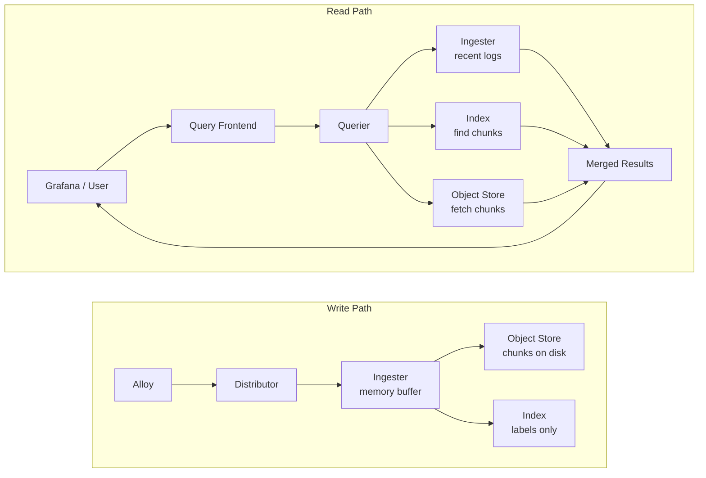

```mermaid
flowchart LR
    subgraph WRITE["Write Path"]
        direction LR
        W1[Alloy] --> W2[Distributor]
        W2 --> W3[Ingester\nmemory buffer]
        W3 --> W4[Object Store\nchunks on disk]
        W3 --> W5[Index\nlabels only]
    end
subgraph READ["Read Path"]
        direction LR
        R1[Grafana / User] --> R2[Query Frontend]
        R2 --> R3[Querier]
        R3 --> R4[Ingester\nrecent logs]
        R3 --> R5[Index\nfind chunks]
        R3 --> R6[Object Store\nfetch chunks]
        R4 & R5 & R6 --> R7[Merged Results]
        R7 --> R1
    end
```
